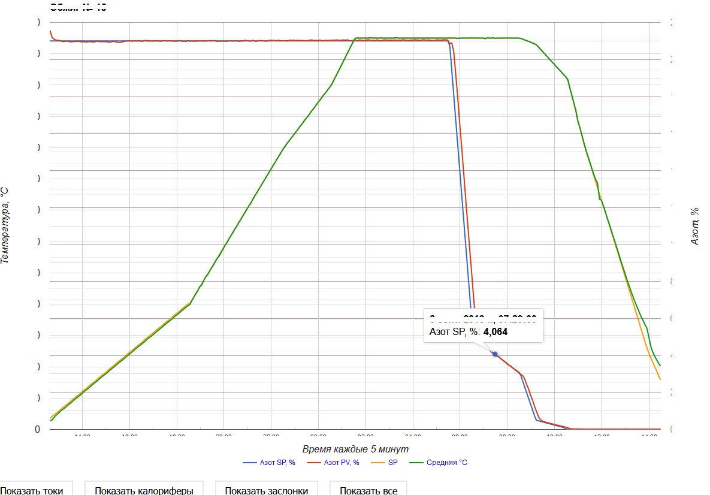
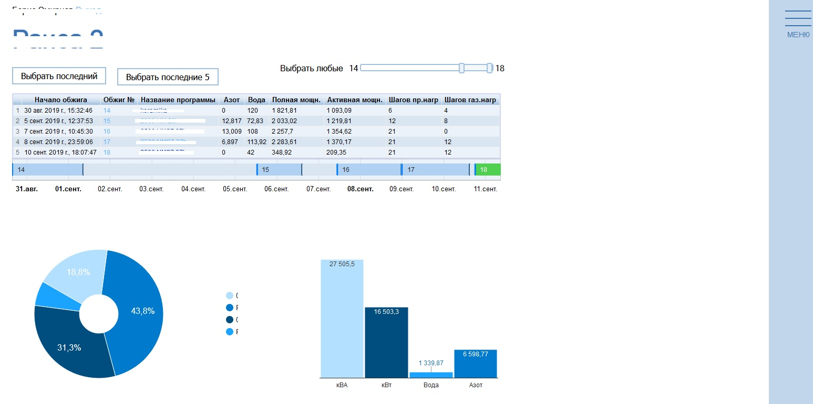
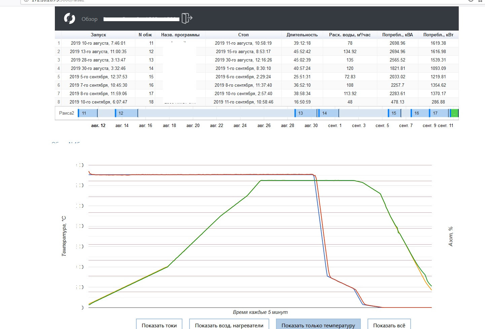
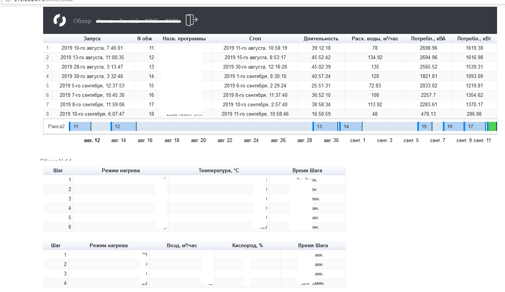

JAVA servlet replacement React project

JAVA servlet screens (with hidden confidential data):
1. overview_old.jpg       - overview screen

2. graph_data_old         - detailed graph data screen
{:height="200px"}
3. detailed_data_old      - more details
{:height="200px"}

REACT screens:
1. react_welcome.jpg       - welcome screen
{:height="200px"}
2. react_welcome.jpg       - welcome screen
{:height="200px"}
3. react_welcome.jpg       - welcome screen
{:height="200px"}
4. react_welcome.jpg       - welcome screen
{:height="200px"}
