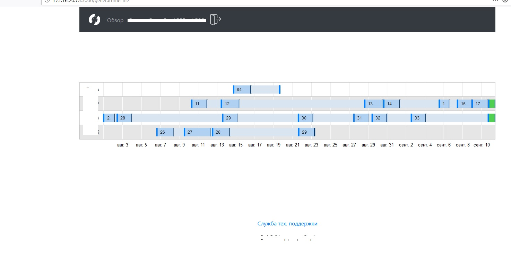

JAVA servlet replacement React project

OLD JAVA servlet screens (with hidden confidential data):
1. overview_old.jpg       - overview screen

2. graph_data_old         - detailed graph data screen

3. detailed_data_old      - more details

NEW REACT screens:
1. react_welcome.jpg       - welcome screen

2. react_welcome.jpg       - welcome screen
{:height="200px"}

3. react_welcome.jpg       - welcome screen
{:height="200px"}

4. react_welcome.jpg       - welcome screen
{:height="200px"}

React advantages:
1. Convinient to modify
2. Convinient to scale
3. Faster
